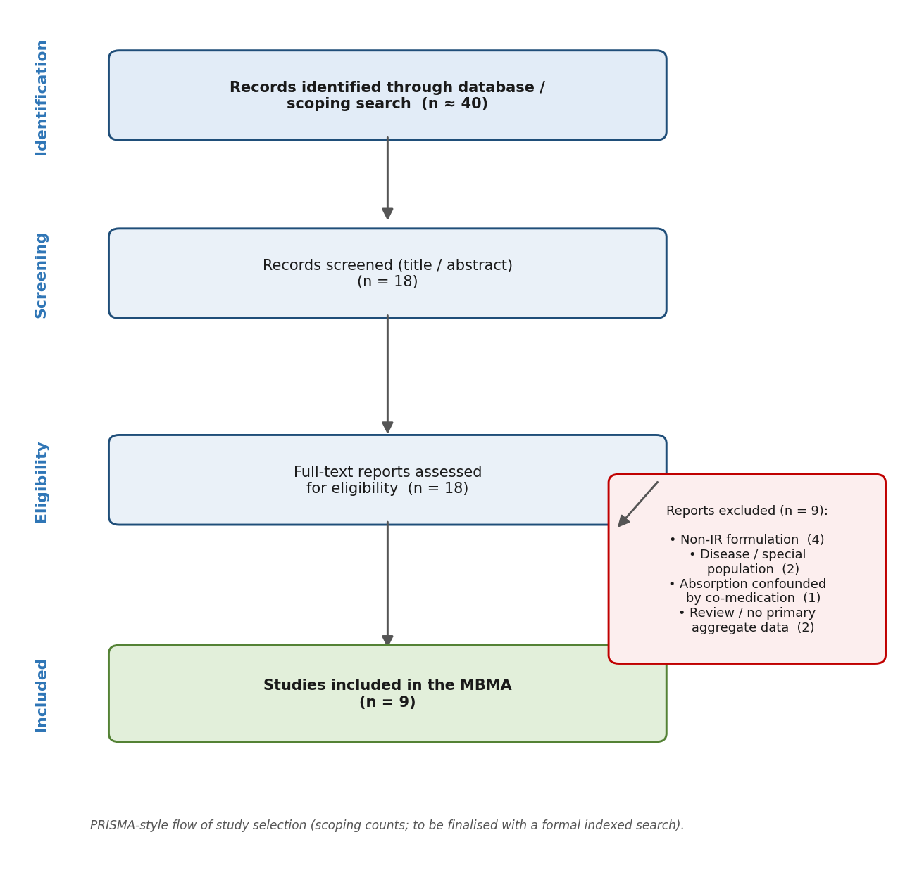
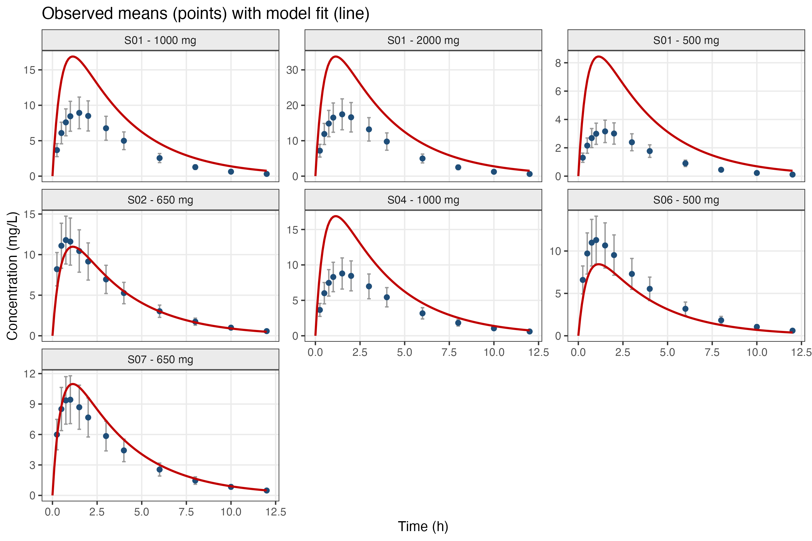
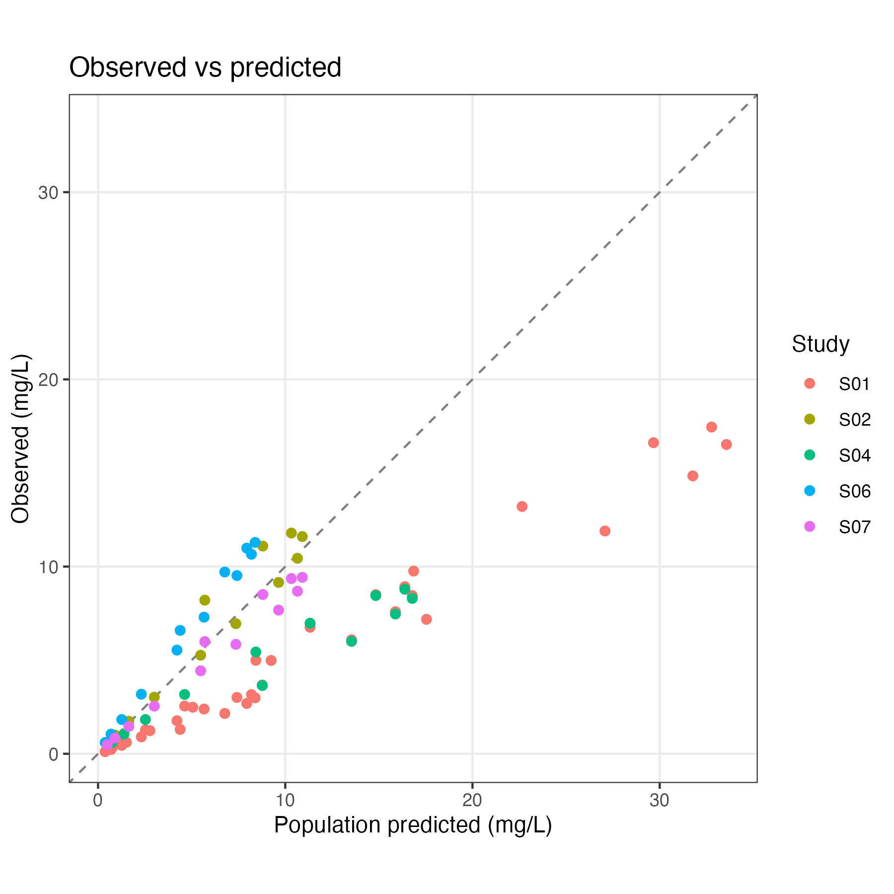
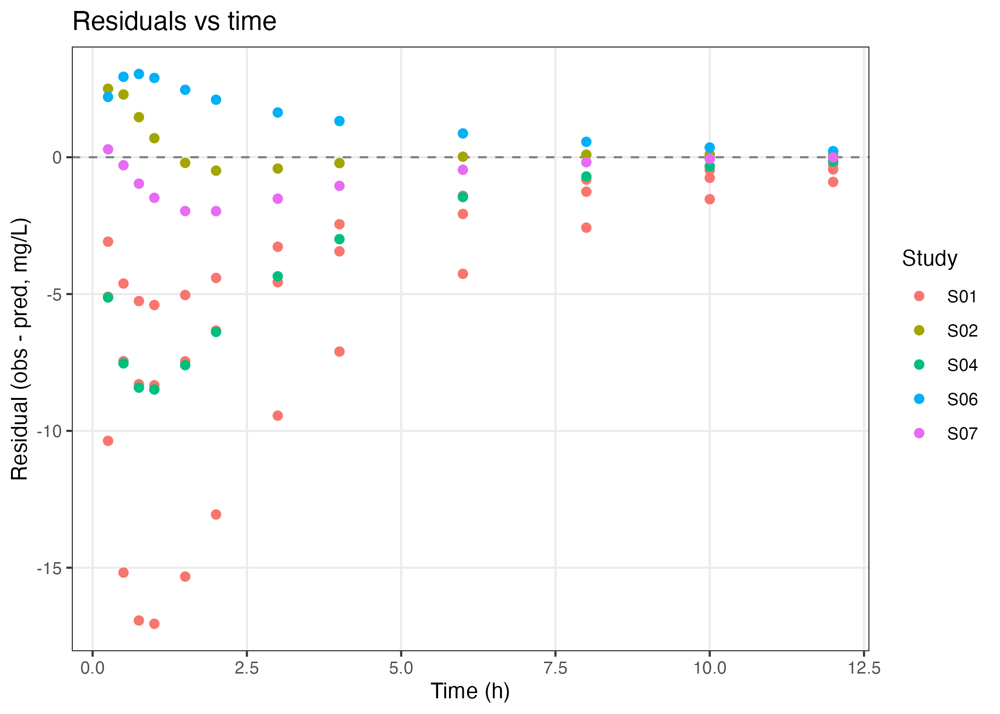

```{=html}
<div class="proj-meta">
  <span class="chip"><b>Type</b> &nbsp;Model-based meta-analysis (MBMA)</span>
  <span class="chip"><b>Tools</b> &nbsp;R · admixr2 · nlmixr2 · rxode2</span>
  <span class="chip"><b>Data</b> &nbsp;Published aggregate (summary-level)</span>
  <span class="chip"><b>Status</b> &nbsp;Pipeline validated (bridge data)</span>
</div>
```

::: {.panel .panel-note}
**Scope statement.** The parameter estimates below come from a **bridge dataset** reconstructed from each study's published NCA parameters (C~max~, T~max~, half-life). They validate the pipeline end to end; they are **not** final scientific estimates. For reportable results the bridge rows are replaced with digitized real concentration–time curves and the pipeline is re-run. This honesty is intentional — the project demonstrates a correct, reproducible MBMA workflow rather than asserting conclusions.
:::

## Overview

A reproducible **model-based meta-analysis (MBMA)** of the pharmacokinetics of oral immediate-release acetaminophen (paracetamol) in healthy adults, fit to **published aggregate (summary-level) data** using the `admixr2` R package. MBMA recovers typical population parameters from study-level means without any individual patient data.

## Scientific question

Can typical oral acetaminophen absorption, clearance and volume be recovered by fitting a single PK model jointly across multiple published studies — and does the workflow correctly detect known structure (e.g. dose-dependent bioavailability)?

## Method in brief

`admixr2` fits an `nlmixr2`/`rxode2` PK model to **aggregate** data: for each study it uses the mean concentration vector, its variance, the sample size, the observation times and the dosing event. The base structural model is one-compartment with first-order oral absorption, estimating apparent clearance (CL/F) and volume (V/F) — the parameters identifiable from oral-only data.

## Study selection

Studies were screened with a documented, PRISMA-style workflow (selection log and per-paper rationale are versioned in the repository).

```{=html}
<figure class="sci-fig">
  
  <figcaption><b>Study selection.</b> PRISMA-style flow from identified records to the included study arms used in the meta-analysis.</figcaption>
</figure>
```

## Results (bridge data)

One-compartment, first-order-absorption model fit across 5 study arms (500–2000 mg):

| Parameter | Symbol | Estimate | Unit |
|---|---|---:|---|
| Absorption rate constant | k~a~ | 1.94 | 1/h |
| Apparent clearance | CL/F | 12.66 | L/h |
| Apparent volume of distribution | V/F | 42.0 | L |
| Elimination rate constant | k~e~ | 0.30 | 1/h |
| Elimination half-life | t½ | 2.30 | h |
| Time to peak (1000 mg) | T~max~ | 1.14 | h |
| Peak concentration (1000 mg) | C~max~ | 16.9 | mg/L |
| Exposure (1000 mg) | AUC~0–∞~ | 79.0 | mg·h/L |

: Recovered parameters from the bridge dataset (pipeline validation, not reportable estimates). {tbl-colwidths="[42,14,22,22]"}

**Structural model:** the one-compartment model was preferred over a two-compartment alternative (AIC 2397.6 vs 2399.9 — the second compartment did not improve the fit enough to justify the extra parameters).

**Covariate (dose):** apparent parameters shifted between the low-dose (≤700 mg) and high-dose (≥1000 mg) strata, consistent with the known dose-dependence of oral acetaminophen bioavailability (Rawlins 1977). The high-dose stratum has only two studies, so this is indicative, not definitive.

```{=html}
<div class="fig-grid">
  <figure class="sci-fig">
    
    <figcaption><b>Fit overlay.</b> Model predictions against the published mean concentration–time profiles by study arm.</figcaption>
  </figure>
  <figure class="sci-fig">
    
    <figcaption><b>Observed vs predicted.</b> Aggregate-level concentrations against model predictions.</figcaption>
  </figure>
</div>
```

```{=html}
<figure class="sci-fig">
  
  <figcaption><b>Residuals vs time.</b> No strong time-trend in the residuals for the selected structure.</figcaption>
</figure>
```

## Interpretation

The recovered typical values are physiologically plausible for oral acetaminophen and the workflow correctly prefers the parsimonious structure and flags dose-dependence — confirming the pipeline behaves correctly end to end. Because the inputs are a bridge dataset, the numbers are treated as a methods demonstration, not as evidence about acetaminophen PK.

## Limitations

- Estimates derive from a reconstructed bridge dataset, not digitized real curves.
- Oral-only aggregate data identify apparent (CL/F, V/F) rather than absolute parameters.
- The dose-covariate signal rests on few high-dose studies.

## Reproducibility

`scripts/run_all.R` runs the full pipeline; numbered scripts cover setup, extraction, dataset assembly, model fitting, structural comparison, covariate analysis and plotting; session info and a digitizing guide are versioned for a clean re-run on real curves.

## References

- Rawlins MD, *et al.* (1977). Variability in the systemic availability of paracetamol. *Eur J Clin Pharmacol.*
- `admixr2` — aggregate-data modelling on the `nlmixr2` stack.

## Source code

- **Repository:** [github.com/pbr26/MBMA_Acetaminophen_PK](https://github.com/pbr26/MBMA_Acetaminophen_PK)

[← All projects](../projects.qmd)
