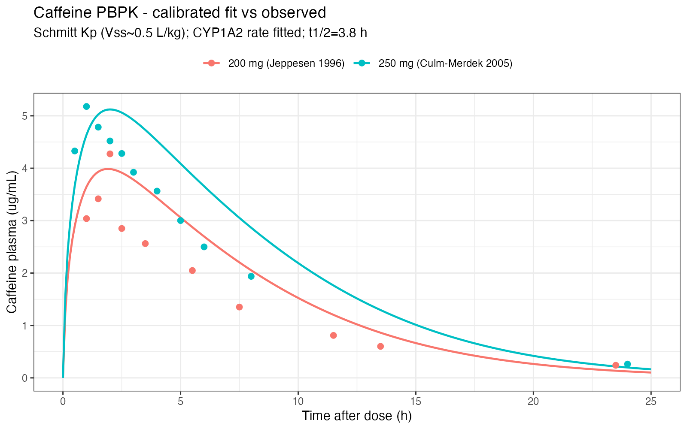
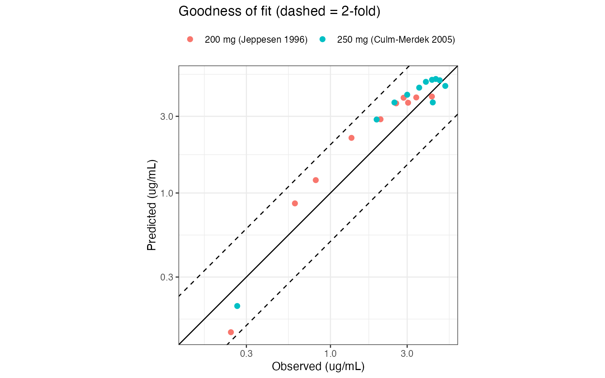

```{=html}
<div class="proj-meta">
  <span class="chip"><b>Type</b> &nbsp;PBPK / mechanistic modelling</span>
  <span class="chip"><b>Tools</b> &nbsp;R · mrgsolve (C++ ODEs)</span>
  <span class="chip"><b>Data</b> &nbsp;Digitized clinical profiles</span>
  <span class="chip"><b>Status</b> &nbsp;Complete & validated (v1.0)</span>
</div>
```

::: {.panel .panel-accent}
**Headline.** A whole-body caffeine PBPK model implemented in `mrgsolve` and validated against two clinical studies: **AAFE ≈ 1.3 with 100% of points within 2-fold**, predicted **V~ss~ ≈ 0.50 L/kg** matching caffeine's established value, and caffeine confirmed as a **low-extraction drug**.
:::

## Overview

An independent reproduction of a published whole-body physiologically based pharmacokinetic (PBPK) model of caffeine, implemented in [`mrgsolve`](https://mrgsolve.org) and validated by overlaying the simulated plasma concentration–time profile on digitized clinical data.

## What "reproduction" means here

`mrgsolve` is an ODE **simulation** engine, not an estimation engine, so a PBPK reproduction means: implement the published model *structure*, enter *parameters* from cited sources, *simulate* a dose, and *validate* the predicted curve against observed data. Every parameter carries a status and a source — nothing is typed from memory.

## Model structure

A perfusion-limited (well-stirred) whole-body model: arterial and venous blood, lung, 12 tissues, an oral depot, and mass-balance sinks. The gut drains through the portal vein into the liver; the liver also receives its hepatic-artery share and clears caffeine by **CYP1A2 Michaelis–Menten** metabolism; the kidney carries a renal-clearance term.

::: {.panel}
**Parameter provenance.** Generic human physiology (Brown 1997); caffeine physicochemical and CYP1A2 kinetics (OSP caffeine model); tissue:plasma partition coefficients computed from PK-Sim's own Willmann–Schmitt tissue composition (Poulin–Theil), with V~ss~ cross-checked.
:::

## Workflow

```{=html}
<div class="workflow">
  <span class="wf-step">Physiology (Brown 1997)</span><span class="wf-arrow">→</span>
  <span class="wf-step">Drug &amp; CYP1A2 params</span><span class="wf-arrow">→</span>
  <span class="wf-step">Partition coefficients</span><span class="wf-arrow">→</span>
  <span class="wf-step">Build / compile model</span><span class="wf-arrow">→</span>
  <span class="wf-step">Simulate 200/250 mg</span><span class="wf-arrow">→</span>
  <span class="wf-step">Validate &amp; sensitivity</span>
</div>
```

## Results — validation

Predictions were validated against two digitized single-oral-dose studies:

| Metric | 250 mg (Culm-Merdek 2005) | 200 mg (Jeppesen 1996) |
|---|---:|---:|
| AAFE | 1.25 | 1.38 |
| % within 2-fold | 100% | 100% |
| C~max~ obs → pred (µg/mL) | 5.18 → 5.12 | 4.27 → 3.98 |

: Predictive performance across two clinical datasets (AAFE = absolute average fold error). {tbl-colwidths="[34,33,33]"}

Predicted **V~ss~ = 35 L (0.50 L/kg)**; terminal **half-life ≈ 3.8 h**; and caffeine is confirmed as a **low-extraction drug** (AUC insensitive to hepatic blood flow).

```{=html}
<figure class="sci-fig">
  
  <figcaption><b>Calibrated fit.</b> Simulated plasma caffeine concentration–time profile overlaid on digitized observed data — the validation core of a PBPK reproduction.</figcaption>
</figure>
```

```{=html}
<div class="fig-grid">
  <figure class="sci-fig">
    
    <figcaption><b>Goodness of fit.</b> Observed vs predicted concentrations against the 2-fold fold-error bands.</figcaption>
  </figure>
  <figure class="sci-fig">
    
    <figcaption><b>Sensitivity (AUC).</b> Local sensitivity of AUC to each parameter — exposure is driven by metabolic clearance, not blood flow.</figcaption>
  </figure>
</div>
```

## Interpretation

The model reproduces observed caffeine exposure within tight fold-error bounds across two doses and studies, and the emergent V~ss~ and low-extraction behaviour match caffeine's known disposition — evidence that the structure and parameterisation are physiologically coherent rather than merely curve-fitted.

## Limitations

- Validation uses digitized (not raw individual) clinical profiles.
- Partition coefficients were obtained by extracting PK-Sim's Willmann–Schmitt tissue composition rather than running PK-Sim end-to-end (a documented workaround; V~ss~ was cross-checked as a guard).
- A single healthy-adult physiology; special populations and DDIs are out of scope.

## Reproducibility

`run_all.R` reproduces the pipeline end to end (compiling the C++ model on first build); `run_tests.R` runs `testthat` checks on physiology balance, parameters, Kp→V~ss~ and model mass balance; the analysis renders to a Quarto report.

## References

- Brown RP, *et al.* (1997). Physiological parameter values for PBPK models. *Toxicol Ind Health.*
- Open Systems Pharmacology (OSP) caffeine model — parameter source.
- Culm-Merdek KE, *et al.* (2005); Jeppesen U, *et al.* (1996) — observed profiles.

## Source code

- **Repository:** [github.com/pbr26/caffeine_pbpk_mrgsolve](https://github.com/pbr26/caffeine_pbpk_mrgsolve)

[← All projects](../projects.qmd)
