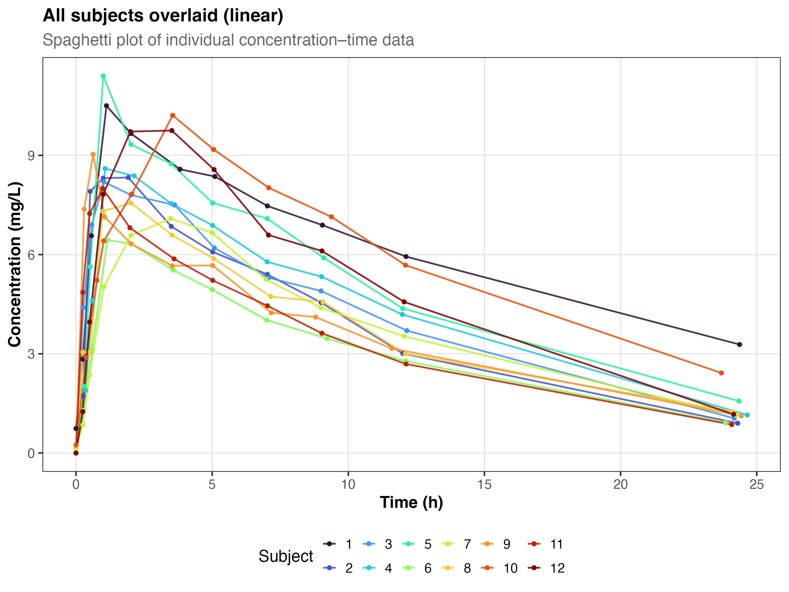
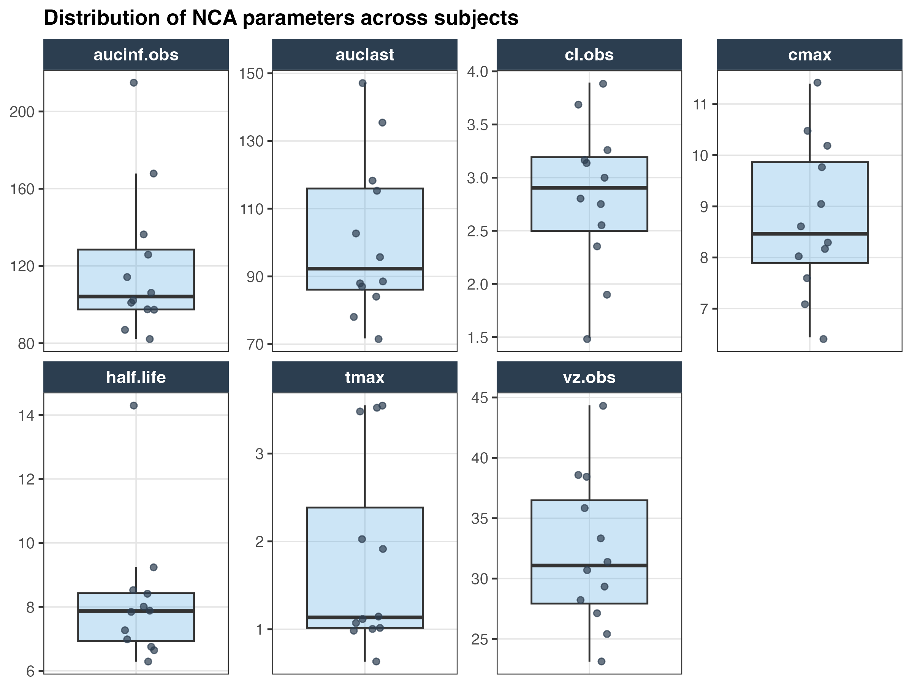
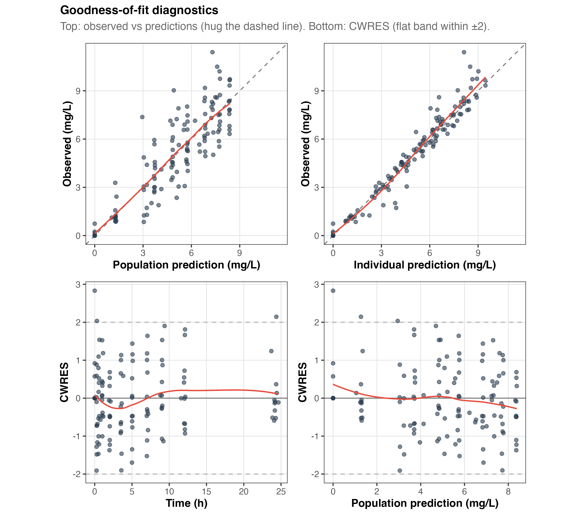
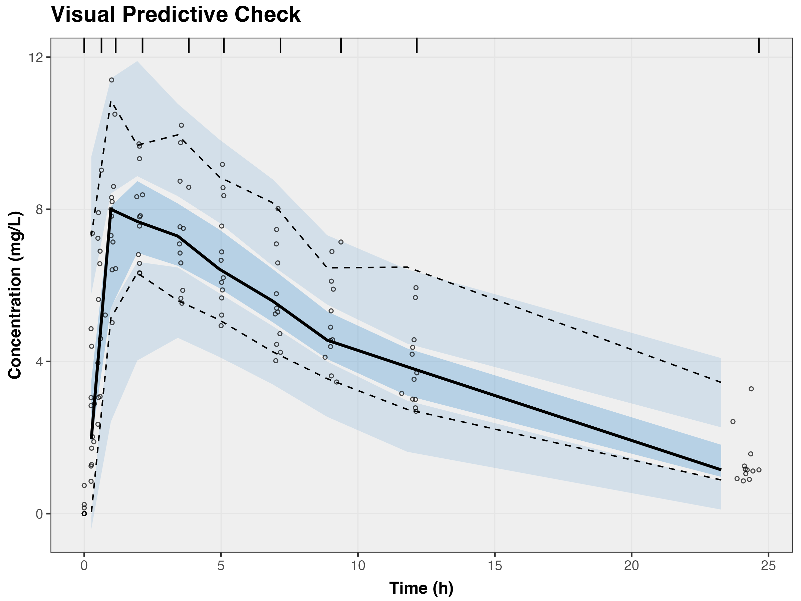
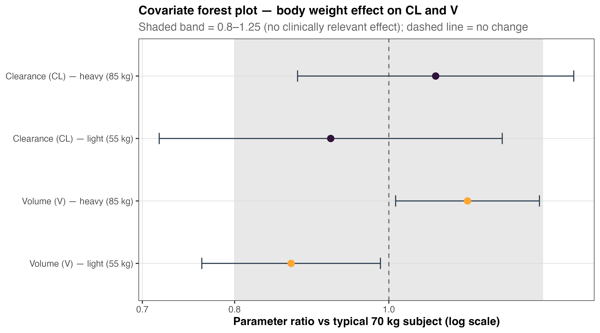
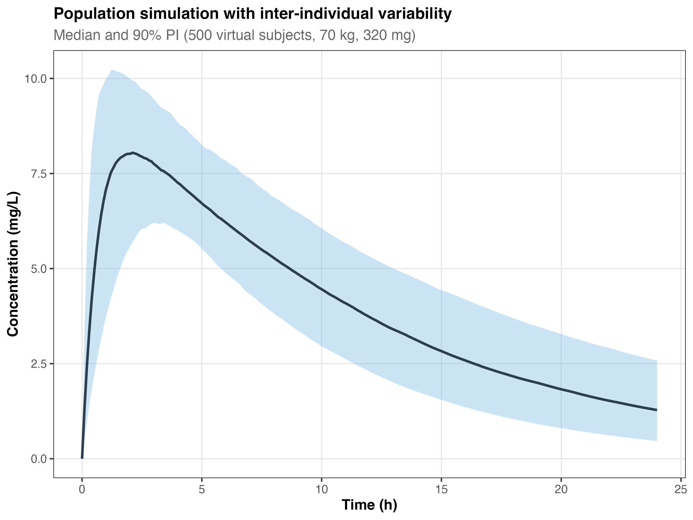

```{=html}
<div class="proj-meta">
  <span class="chip"><b>Type</b> &nbsp;Population PK (end-to-end)</span>
  <span class="chip"><b>Tools</b> &nbsp;R · nlmixr2 · rxode2 · PKNCA</span>
  <span class="chip"><b>Data</b> &nbsp;Public (<code>Theoph</code>, 12 subjects)</span>
  <span class="chip"><b>Status</b> &nbsp;Complete</span>
</div>
```

::: {.panel .panel-accent}
**Headline.** A complete, reproducible PopPK pipeline — EDA → NCA → base model → IIV → weight covariate → diagnostics → simulation — built with `renv`-locked dependencies and rendered to a published Quarto site. A one-compartment oral model was selected; body weight is a credible covariate on volume.
:::

## Overview

A fully reproducible, phase-by-phase population pharmacokinetic (PopPK) analysis of the classic `Theoph` dataset, built in R with `nlmixr2` / `rxode2`, `PKNCA` and Quarto, and published as a multi-report website.

## Scientific question

Theophylline is a narrow-therapeutic-index bronchodilator with well-characterised one-compartment oral PK. Using a benchmark dataset with rich serial sampling, the project asks: what is the typical PK, how large is inter-individual variability, and does body weight explain part of it — carried through a defensible model-building sequence with proper diagnostics?

## Data

The built-in `Theoph` dataset: 12 subjects, single oral dose, serial plasma theophylline concentrations, with body weight as the covariate of interest.

```{=html}
<figure class="sci-fig">
  
  <figcaption><b>Exploratory data analysis.</b> Individual concentration–time profiles (spaghetti plot) — a classic first-order absorption, one-compartment signal.</figcaption>
</figure>
```

## Noncompartmental analysis

NCA (via `PKNCA`) provides model-independent exposure metrics as a baseline before modelling:

| Parameter | N | Geo. mean | Geo. CV % | Median |
|---|---:|---:|---:|---:|
| C~max~ (mg/L) | 12 | 8.65 | 17.0 | 8.47 |
| t~max~ (h) | 12 | 1.52 | 64.7 | 1.14 |
| AUC~last~ (mg·h/L) | 12 | 98.7 | 22.5 | 92.3 |
| AUC~inf~ (mg·h/L) | 12 | 114.8 | 28.4 | 104.1 |
| t½ (h) | 12 | 7.99 | 21.9 | 7.87 |
| CL/F (L/h) | 12 | 2.74 | 27.9 | 2.90 |
| V~z~/F (L) | 12 | 31.6 | 19.2 | 31.1 |

: NCA summary across 12 subjects (geometric statistics). {tbl-colwidths="[34,8,16,16,16]"}

```{=html}
<figure class="sci-fig">
  
  <figcaption><b>NCA parameter distributions.</b> Spread of exposure and disposition metrics across subjects.</figcaption>
</figure>
```

## Model development

A one-compartment model with first-order absorption was fit as the base structure, extended with inter-individual variability (IIV), then tested against a two-compartment alternative. The one-compartment model was retained on parsimony:

| Model | OFV | AIC | BIC | nPar |
|---|---:|---:|---:|---:|
| **1-compartment (selected)** | 104.4 | **363.0** | 386.0 | 8 |
| 2-compartment | 102.7 | 365.3 | 394.2 | 10 |

: Structural model comparison — the second compartment reduced OFV by only 1.6 for two extra parameters, so AIC/BIC favour the one-compartment model. {tbl-colwidths="[40,15,15,15,15]"}

## Diagnostics

```{=html}
<div class="fig-grid">
  <figure class="sci-fig">
    
    <figcaption><b>Goodness of fit.</b> DV vs PRED/IPRED and CWRES vs time/prediction — no gross structural misspecification.</figcaption>
  </figure>
  <figure class="sci-fig">
    
    <figcaption><b>Visual predictive check.</b> Observed percentiles track the model-simulated prediction intervals.</figcaption>
  </figure>
</div>
```

## Covariate analysis

A body-weight covariate was evaluated on clearance and volume. The effect on **volume** is credible (confidence interval excludes the null), while the effect on clearance is weaker:

```{=html}
<figure class="sci-fig">
  
  <figcaption><b>Covariate forest.</b> Relative change in CL and V for a light (55 kg) and heavy (85 kg) subject vs the typical individual. For volume the intervals exclude 1 (≈0.87 and ≈1.12), indicating a real weight effect; for clearance they straddle 1.</figcaption>
</figure>
```

## Simulation

The final model is used to simulate typical and weight-stratified population profiles for dose exploration:

```{=html}
<figure class="sci-fig">
  
  <figcaption><b>Clinical simulation.</b> Population prediction intervals from the final model, supporting dose/regimen exploration.</figcaption>
</figure>
```

## Interpretation

Theophylline's PK is well described by a one-compartment oral model; inter-individual variability is moderate and body weight explains part of the variability in volume, consistent with allometric expectations. The full model-building sequence — base → IIV → covariate → diagnostics → simulation — mirrors a standard regulatory PopPK workflow on a tractable benchmark.

## Limitations

- Educational benchmark dataset (12 subjects, single dose); estimates are illustrative, not for clinical use.
- The covariate evaluation is a screening-level analysis on a small dataset.

## Reproducibility

Dependencies are locked with `renv` (`renv.lock`); snapshots are taken after each phase; every report renders to `docs/` for the published website. Analysis is organised as one R script per phase with saved figures and tables.

## References

- Boeckmann, Sheiner & Beal — the `Theoph` dataset (distributed with R).
- Dunvald *et al.* (2022). Tutorial: statistical analysis and reporting of clinical pharmacokinetic studies. *Clin Transl Sci* (methodological reference included in the repo).

## Source code

- **Live site:** <https://pbr26.github.io/Theoph_poppk_portfolio/>
- **Repository:** [github.com/pbr26/Theoph_poppk_portfolio](https://github.com/pbr26/Theoph_poppk_portfolio)

[← All projects](../projects.qmd)
