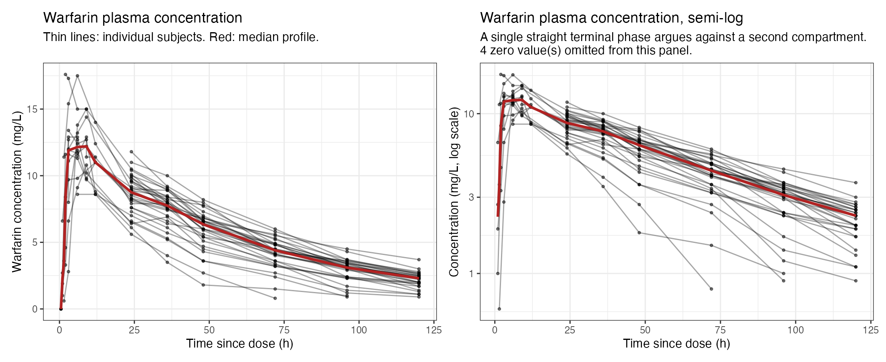
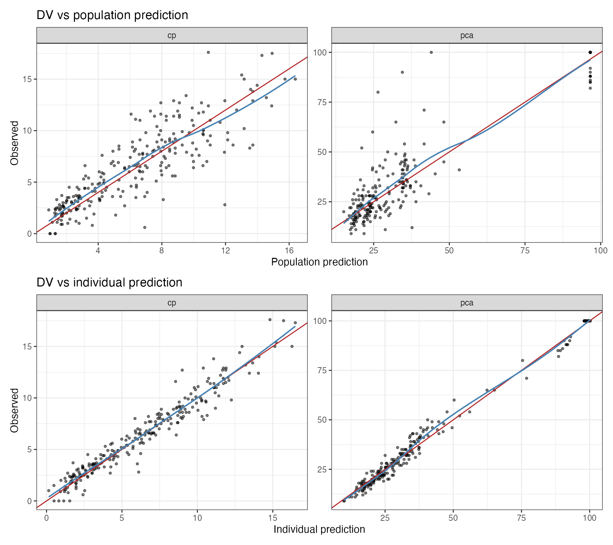
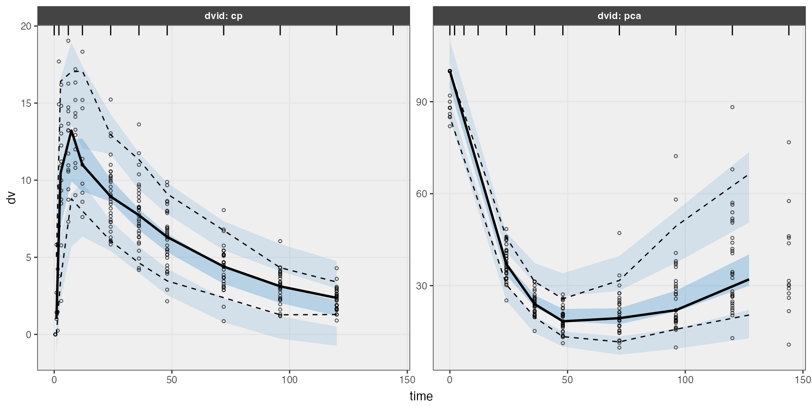
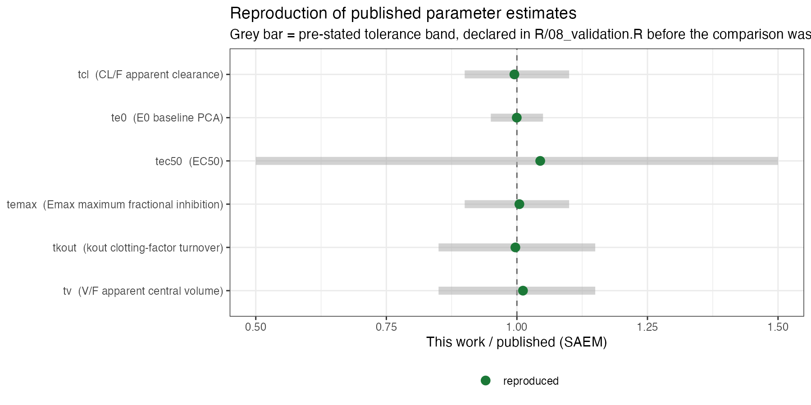
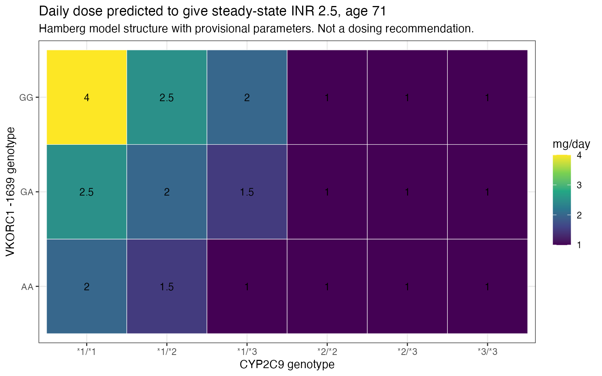
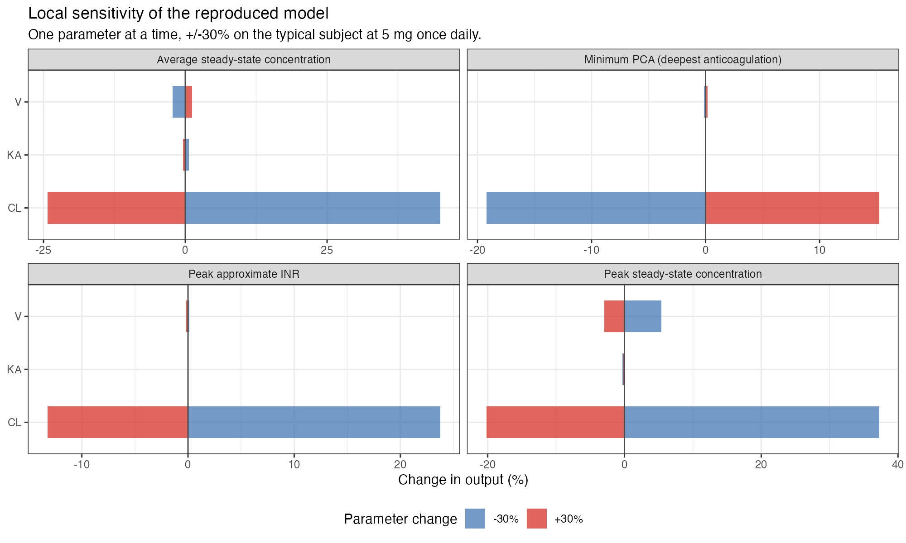

```{=html}
<div class="proj-meta">
  <span class="chip"><b>Type</b> &nbsp;Population PK/PD reproduction</span>
  <span class="chip"><b>Tools</b> &nbsp;R · nlmixr2 · rxode2</span>
  <span class="chip"><b>Data</b> &nbsp;Public (O'Reilly/Holford) + simulated</span>
  <span class="chip"><b>Status</b> &nbsp;Complete (v1.0)</span>
</div>
```

::: {.panel .panel-accent}
**Headline.** Reproduced the published warfarin PK/PD model with **6 / 6 verdict parameters within pre-stated tolerances** (four within ~1%); independently recovered the Hamberg *et al.* (2007) genotype–INR model structure by simulation to within ~7%; and caught four transcription errors in the published clearance factors while verifying every constant against the primary source.
:::

## Overview

This project is an independent, two-part reproduction study of warfarin population pharmacokinetics/pharmacodynamics (PK/PD), implemented entirely in the R pharmacometrics ecosystem.

**Part 1 — reproduction on real data.** Re-estimate a published warfarin PK/PD turnover–E~max~ model on the O'Reilly warfarin dataset and compare the estimates against the published values.

**Part 2 — reproduction by simulation.** Implement the Hamberg *et al.* (2007) S-warfarin → INR model structure in `rxode2`, simulate a virtual trial from the published parameters, re-estimate those parameters in `nlmixr2` to demonstrate parameter recovery, then use the model to explore alternative dosing regimens and patient characteristics.

## Scientific question

Warfarin is a narrow-therapeutic-index anticoagulant with pronounced pharmacogenetic variability (`CYP2C9`, `VKORC1`). Two questions frame the work:

1. **Reproduction.** Given the same public data, can the published population PK/PD estimates be recovered with an independent implementation?
2. **Identifiability & prediction.** Is the reference genotype-guided dosing model (Hamberg 2007) identifiable from a realistic INR-monitoring schedule, and what does it predict under alternative dosing and covariate scenarios?

## Background

The reference model for genotype-guided warfarin dosing (Hamberg *et al.*, 2007) links S-warfarin exposure to INR through a clotting-factor turnover model. Its individual-level data (150 patients) are **not publicly available**, which rules out a literal re-estimation. Rather than digitise figures and present that as real data, the project separates the two things a reproduction actually demonstrates:

| | Part 1 (O'Reilly / Holford data) | Part 2 (Hamberg structure) |
|---|---|---|
| Data | Real, public, subject-level | Simulated from published parameters |
| Endpoint | PCA (prothrombin complex activity) | INR |
| Question | Do I recover the published estimates? | Is the model identifiable, and what does it predict? |
| Claim | Reproduction | Structural implementation + parameter recovery |

PCA and INR describe the same underlying coagulation process from opposite directions (INR ≈ (PCA/100)^−γ^), so the two parts are complementary views of the same pharmacology.

## Data

**Part 1** uses `nlmixr2data::warfarin` — 32 subjects, a single oral dose (~1.5 mg/kg), with plasma warfarin concentration (mg/L) and prothrombin complex activity (PCA, % of normal) followed to 120 h; derived from O'Reilly *et al.* (1963, 1968) and curated by Nick Holford. The pipeline writes the raw data to CSV so it is file-based and does not silently depend on a package version.

**Part 2** data are simulated from the published Hamberg parameters; nothing in the real dataset is simulated.

```{=html}
<figure class="sci-fig">
  
  <figcaption><b>Observed data (Part 1).</b> Plasma warfarin concentration and the PCA (prothrombin complex activity) response over time — the joint PK/PD signal the model is fit to.</figcaption>
</figure>
```

## Model structure

**Pharmacokinetics** — one-compartment disposition with a transit step before absorption:

```
d/dt(depot)  = -ktr * depot
d/dt(gut)    =  ktr * depot - ka * gut
d/dt(center) =  ka  * gut   - (cl/v) * center
cp           =  center / v
```

**Pharmacodynamics** — indirect-response (turnover) on PCA, with warfarin inhibiting clotting-factor synthesis (`kin`):

```
PD           = 1 - emax * cp / (ec50 + cp)
kin          = e0 * kout
d/dt(effect) = kin * PD - kout * effect
```

`emax` is estimated on the logit scale to stay in (0, 1); remaining structural parameters on the log scale. Between-subject variability is exponential; residual error is proportional + additive on concentration and additive on PCA. The model is estimated by **SAEM** (FOCEi was dropped after its objective function proved not reproducible run-to-run on this stiff model — a documented, honest limitation).

## Software

`R` · `nlmixr2` (SAEM estimation) · `rxode2` (ODE simulation) · `ggplot2` diagnostics · Quarto reporting. Every parameter in Part 2 carries a provenance tag and a source; nothing is typed from memory.

## Results — reproduction on real data

The independent SAEM estimates align closely with the published values across the structural PK/PD parameters:

| Parameter | Unit | Published (SAEM) | This work (SAEM) | Δ % |
|---|---|---:|---:|---:|
| CL/F — apparent clearance | L/h | 0.140 | 0.139 | −0.5 |
| V/F — apparent central volume | L | 7.43 | 7.52 | +1.2 |
| E~0~ — baseline PCA | % | 96.6 | 96.6 | 0.0 |
| E~max~ — max fractional inhibition | – | 0.969 | 0.974 | +0.5 |
| EC~50~ | mg/L | 0.91 | 0.95 | +4.5 |
| k~out~ — clotting-factor turnover | 1/h | 0.0531 | 0.0529 | −0.3 |
| k~a~ — absorption rate | 1/h | 0.77 | 0.91 | +18.1 |
| k~tr~ — transit rate | 1/h | 1.55 | 1.22 | −21.1 |

: Independent estimates vs published values. The absorption parameters (k~a~, k~tr~) show the largest deviations and the highest shrinkage/RSE on this dataset, so they are treated as not reportable — consistent with the published fit. {tbl-colwidths="[34,10,18,18,10]"}

**Verdict:** 6 / 6 pre-specified *verdict* parameters (CL, V, E~0~, E~max~, EC~50~, k~out~) fall within their pre-stated tolerance bands, four within ~1%.

```{=html}
<div class="fig-grid">
  <figure class="sci-fig">
    
    <figcaption><b>Goodness of fit.</b> Observed vs population and individual predictions for both the PK and PD endpoints.</figcaption>
  </figure>
  <figure class="sci-fig">
    
    <figcaption><b>Visual predictive check.</b> Observed percentiles fall within the simulation-based prediction intervals.</figcaption>
  </figure>
</div>
```

```{=html}
<figure class="sci-fig">
  
  <figcaption><b>Reproduction forest.</b> Each reproduced parameter shown against its published value and pre-stated tolerance band — the quantitative core of the reproduction claim.</figcaption>
</figure>
```

## Results — recovery & prediction (Hamberg structure)

Implementing the Hamberg 2007 structure in `rxode2`, simulating a virtual trial, and re-estimating in `nlmixr2` recovers the published parameters within ~7% from a realistic INR-only monitoring schedule; using the paper's exact 6+1 transit structure improved recovery and cut runtime ~6×. A 200-replicate bootstrap confirms the verdict parameters and surfaces one genuinely unstable term — the same instability visible in the published fit.

```{=html}
<div class="fig-grid">
  <figure class="sci-fig">
    
    <figcaption><b>Genotype-guided dosing.</b> Simulated maintenance dose required to reach target INR across CYP2C9 / VKORC1 genotypes.</figcaption>
  </figure>
  <figure class="sci-fig">
    
    <figcaption><b>Sensitivity analysis.</b> Local sensitivity of the exposure/response endpoints to each model parameter (tornado).</figcaption>
  </figure>
</div>
```

## Interpretation

The structural PK/PD parameters that are well identified by the data — clearance, volume, baseline PCA, turnover and the E~max~/EC~50~ pair — reproduce cleanly, supporting the published model. The absorption parameters are poorly identified on this sparse single-dose dataset in both the published and reproduced fits, which is itself a reproducible finding rather than a discrepancy.

## Limitations

- Part 2 is **parameter recovery from simulated data**, not re-estimation on the original Hamberg patients (whose data are not public); it demonstrates identifiability and prediction, not an independent data-based re-fit.
- FOCEi was not reproducible run-to-run on this stiff model and is deliberately excluded.
- Absorption parameters are not reportable on this dataset.
- Simulation results are illustrative of the model's behaviour, not clinical dosing recommendations.

## Reproducibility

The repository is file-based end to end: numbered R scripts, raw/processed data with a data dictionary and provenance file, saved figures and tables, and a Quarto report. Every Part 2 constant is verified against the primary source (which surfaced four transcription errors in the published clearance factors, one off by 45%).

## References

- Hamberg A-K, *et al.* (2007). A PK–PD model for predicting the impact of age, `CYP2C9` and `VKORC1` genotype on individualization of warfarin therapy. *Clin Pharmacol Ther.*
- O'Reilly RA, *et al.* (1963, 1968) — source of the public warfarin dataset (curated by N. Holford, distributed with `nlmixr2data`).

## Source code

- **Full report:** <https://pbr26.github.io/warfarin_pkpd_reproduction/>
- **Repository:** [github.com/pbr26/warfarin_pkpd_reproduction](https://github.com/pbr26/warfarin_pkpd_reproduction)
- **Related:** [warfarin_pkpd_portfolio](https://github.com/pbr26/warfarin_pkpd_portfolio) — earlier PK/PD portfolio build.

::: {.panel .panel-note}
Figures on this page are the project's own analysis outputs, reproduced from the public repository. They illustrate a methodological reproduction study and are not clinical dosing guidance.
:::

[← All projects](../projects.qmd)
